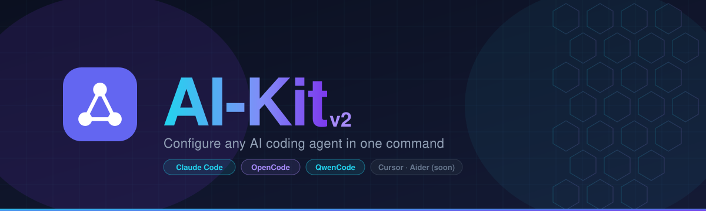

<div align="center">



[](https://www.apache.org/licenses/LICENSE-2.0)
[](https://aequicor.github.io/ai-kit-v2)
[](https://github.com/aequicor/ai-kit-v2/releases)

[**Quick Start**](#quick-start) · [**Docs**](https://aequicor.github.io/ai-kit-v2) · [**Releases**](https://github.com/aequicor/ai-kit-v2/releases)

</div>

---

AI-Kit generates ready-to-use configuration for AI coding agents from reusable presets called **bundles**. One command sets a project up for an agent; another updates or removes it cleanly.

## Why AI-Kit

- **Portability**. Bundles are reusable across projects; connecting a preset to a new project takes a single command.
- **Flexible configuration**. Every bundle accepts `inputs`, letting you tailor the generated config to each project's needs.
- **Multi-agent support**. AI-Kit works with multiple AI coding agents simultaneously: Claude Code, OpenAI Codex (`AGENTS.md` + `.codex/config.toml`), OpenCode, Qwen Code.
- **Security**. Secrets never live in the manifest directly; values can be referenced from environment variables.
- **Multi-profile / multi-manifest**. Connect several manifests for different working modes, e.g. separate profiles for development and CI.
- **Open**. Apache 2.0 licensed; third-party bundles from any source can be plugged in with no friction.
- **Simple**. To get started, paste one prompt into your agent and it configures everything automatically.

## Quick Start

Tell any AI coding agent with tool use (Claude Code, Cursor, Codex, etc.) opened in your project:

```
Установи https://github.com/aequicor/ai-kit-v2
```

or, more explicitly:

```
Read prompts/install.md from https://github.com/aequicor/ai-kit-v2 and follow
the installation instructions for this project.
```

The agent downloads the versioned CLI binary (verifying its SHA256 checksum), inspects your project, proposes a preset — by default the remote `my-bundle`, which the CLI fetches from this repository on demand — and generates the configuration. After installation the `ai-kit` skill keeps the setup manageable in natural language: "установи скилл X", "обнови кит", "удали кит".

## What the installer does

- Picks a preset and asks for a few project inputs.
- Writes ready-to-use config files into your project at the locations each agent expects.
- The manifest is the single source of truth: customize the install by editing the manifest, not the generated files.
- Re-run to regenerate from the manifest; the update report shows what was created, updated, or left unchanged.
- Can be fully removed at any time.

## Built-in presets

| Preset                | What you get                                                                                              |
|-----------------------|-----------------------------------------------------------------------------------------------------------|
| `my-bundle@0.2.0` *(remote)* | Universal starter served straight from this repository (`source: "remote"` — the CLI downloads the `main` branch tip itself, no binary release needed for bundle updates). Targets **Claude Code and Codex**. Adapts to any stack via inputs (`stack`, `buildCommand`, `testCommand`), ships the `ai-kit` ops skill for natural-language installation management, `review` skill, `code-reviewer` subagent, strict hooks. |
| `simple-kit@0.0.1`    | Minimal starter: CLAUDE.md, skills, subagents, optional GitHub MCP, strict hooks.                         |
| `modern-kit@0.0.1`    | Kotlin-flavored: ktlint / detekt hooks, `kotlin-specialist` & `gradle-troubleshooter` subagents, optional Serena & KnowledgeOS MCP. |
| `flow-kit@0.0.1`      | Autonomous KMP + Ktor pipeline: `/pipeline` orchestrator (analyze → develop → security → interface test → commit), role subagents, `claude-in-mobile` MCP for UI autopilot, `maven-indexer` MCP for reading decompiled / source dependency code. Self-documenting: code is the source of truth. |
| `parallel-work-kmp@0.0.1` | KMP across parallel Claude Code worktree sessions: lean operational CLAUDE.md (no architecture overview — per the ETH study on context-file bloat), `parallel-sessions` skill (native `claude --worktree`, `.worktreeinclude`, per-session device/port/`applicationId` lane, parallel-tuned `gradle.properties`), `snapshot-testing` skill (Roborazzi / Compose Preview as the emulator-free parallel UI layer), and a `guard-device` strict hook against unscoped `adb`/`simctl`. |

Third-party bundles can be placed in `.aikit/bundles/<bundle-name>/` as a directory or `.zip`, or served from any GitHub repository via `source: "remote:<owner>/<repo>/<path>[@<branch>]"` — see [docs](https://aequicor.github.io/ai-kit-v2).

## Update, remove, rollback

- `kit-setup update` — refresh the installation from the current manifest. For `remote` bundles this also pulls the branch tip and records the new commit sha in the lock file.
- `kit-setup update self` — show instructions for upgrading the CLI binary.
- `kit-setup remove` — uninstall everything AI-Kit added. Combine with `git` to roll back to a clean state.

See the docs for flags, dry-runs, and edge cases.

## Documentation

**Getting started**
- [Overview](https://aequicor.github.io/ai-kit-v2/#/)
- [Start guide](https://aequicor.github.io/ai-kit-v2/#/start)

**Agents**
- [Claude Code](https://aequicor.github.io/ai-kit-v2/#/claude)
- [OpenCode](https://aequicor.github.io/ai-kit-v2/#/opencode)
- [QwenCode](https://aequicor.github.io/ai-kit-v2/#/qwen)

## Contributing

Issues and pull requests are welcome at [github.com/aequicor/ai-kit-v2](https://github.com/aequicor/ai-kit-v2).

**Reporting bugs and ideas** — open an issue; describe what you expected vs. what happened, and attach the relevant manifest fragment if applicable.

**Pull requests**

- For anything beyond a trivial fix, open an issue first so the approach can be agreed on before you invest time coding.
- One PR — one task; keep the scope focused.
- Branch off `main`; use a descriptive name: `feat/`, `fix/`, or `chore/` prefix.
- Unit tests and E2E tests must pass before opening the PR.
- Include a description: what changed and why.

**Setting up locally**

Prerequisites: JDK 21, Git.

```bash
git clone https://github.com/aequicor/ai-kit-v2.git
cd ai-kit-v2/kit-setup

./gradlew build                          # build all targets
./gradlew :modules:engine:allTests       # run unit tests
```

**E2E tests** run against a real built binary — they are not part of `build`:

```bash
# 1. Build the native binary for your platform
./gradlew :modules:cli:linkReleaseExecutableMacosArm64   # macOS arm64
# or: :linkReleaseExecutableLinuxX64 / :linkReleaseExecutableMingwX64

# 2. Run E2E
./gradlew :modules:e2e:test \
  -Pkit.binary="$(pwd)/modules/cli/build/bin/macosArm64/releaseExecutable/cli.kexe"

# Run a single test class
./gradlew :modules:e2e:test --tests "*LifecycleTest*" \
  -Pkit.binary="$(pwd)/modules/cli/build/bin/macosArm64/releaseExecutable/cli.kexe"
```

If `-Pkit.binary` is omitted, the module looks for the binary in the standard build output paths.

Architecture overview: [`kit-setup/CLAUDE.md`](kit-setup/CLAUDE.md).

**Adding or editing a bundle** — read [`kit-setup/bundles/README.md`](kit-setup/bundles/README.md) first; it has the conventions checklist and links to the format specs.

## License

Apache 2.0
